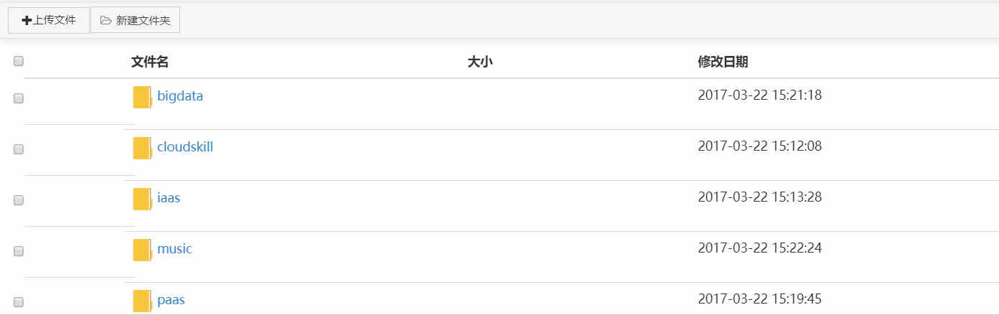

# 0.写在所有功能前

## main.js的点击文件配置



```javascript
<script>
	//获得选择的对象
	function getSelected(){
		var selected = $('label.table-checkboxposition.checked')
		return selected
	}
	//获取所选对象的路径
	function getSelectedPath(){
		var selected = getSelected()
		var filepath = []
		$(selected.parents("tr").find("td.table-path")).each(function(){
				filepath.push($(this).text())
			}
		)
		return filepath
	}
	
	//显示工具栏
	function show(){
		setTimeout(function(){
			var selected = getSelected()
			if(selected.size()>0){
				$('button#delete').show()
				$('a[type="button"]#download').show()
				$('a#copy').show()
				$('a#move').show()
				if(selected.size()==1){
					$('button#rename').show()
					$('a#selectColumn').show()
				}else{
					$('button#rename').hide()
					$('a#selectColumn').hide()
				}
			}else{
				$('button#delete').hide()
				$('a[type="button"]#download').hide()
				$('button#rename').hide()
				$('a#copy').hide()
				$('a#move').hide()
				$('a#selectColumn').hide()
			}
		},100)
	}
	</script>
```




 题外话现在的话JS 提倡不写分号，虽然在某些情况下JS是要写分号的不然会出现问题。

  \[ 、 \( 、 + 、 - 之前加分号就可以了 ****[**贴个知乎的链接**](https://www.zhihu.com/question/20298345)


可以注意到的上面`show()`函数 里面套了一个`setTimeout()`这个时间函数，原因是在`js`里异步执行是常态，如果不用这个时间函数我们`getSelected()` 还没执行的时候，后面的代码已经执行完了所以会出现如下的诡异情况。比赛的时候如上的方法对比赛计较简单合适 原理是`js`的代码执行是单线程的\(这段代码的运行情况是同步任务执行栈已经执行完了==&gt;`setTimeout()`回调==》然后添加并读取任务队列里的回调函数也就是`getSelected()`\) 可以用这种套一个`setTimeout()` 来达到伪同步的效果 可以[异步转同步](https://segmentfault.com/q/1010000012347682/a-1020000012347994) 也可以用其他的方式 这边的知识可以参考[阮一峰的说明](http://www.ruanyifeng.com/blog/2014/10/event-loop.html)




