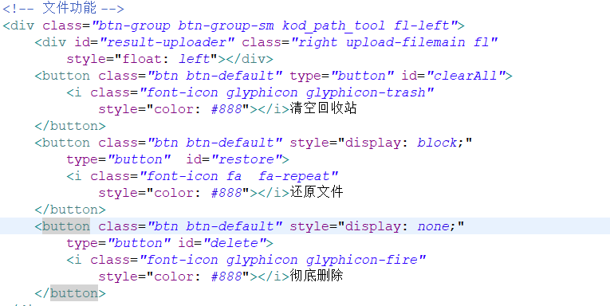

# 3.我的垃圾箱

## `main.jsp`

添加garbage的跳转

```markup
<a class="list-group-item" href="garbage.action"><span
							class="glyphicon glyphicon-trash left-icon"></span>&nbsp;&nbsp;垃圾箱</a>
```


 我们要在`jsp`的目录新建一个`garbage.jsp`的新文件来对应请求，内容和main.jsp大致一样只需要修改功能按钮就好




## `StorageController.java`

```java
/**
 * 回收站
 */
@RequestMapping("/garbage")
public ModelAndView garbage(HttpServletRequest request,
		HttpServletResponse response, String path) {
	ModelAndView view = new ModelAndView();
	User user = getSessionUser(request);
	path = UtilTools.converStr(path);
	List list = swiftStorageService.getAllStoredList(Constants.GARBAGE_PREFIX+user.getUsername(), path);
	view.addObject("path", path);
	view.addObject("search", "false");
	view.addObject("list", list);
	view.setViewName("/garbage");
	view.addObject("type", 7);
	return view;
}
```

