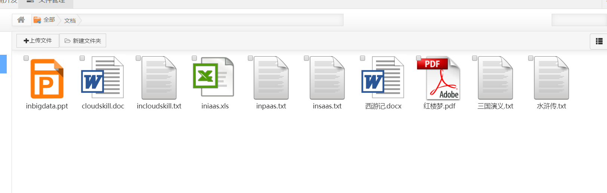

# 12.我的文档\(缩\)

## `gridview.jsp`

在`jsp`目录下新建`gridview.jsp`

```markup
<tbody id="tab">
<c:forEach var="fb" items="${list}" varStatus="status">
	<div class="gridbox">
	<c:choose>
		<c:when test="${fn:endsWith(fb.name,'.mp4')}">
			
		</c:when>
		<c:when test="${fn:endsWith(fb.name,'.doc')}">
			
		</c:when>
		<c:when test="${fn:endsWith(fb.name,'.docx')}">
			
		</c:when>
		<c:when test="${fn:endsWith(fb.name,'.txt')}">
			
		</c:when>
		<c:when test="${fn:endsWith(fb.name,'.ppt')}">
			
		</c:when>
		<c:when test="${fn:endsWith(fb.name,'.xls')}">
			
		</c:when>
		<c:when test="${fn:endsWith(fb.name,'.pdf')}">
			
		</c:when>
		<c:when test="${fn:endsWith(fb.name,'.mp3')}">
			
		</c:when>
		<c:otherwise>
			
		</c:otherwise>
	</c:choose>
		<p style="margin:0" class="p_checkbox">
			<input type="checkbox" name="checkbox" id="${status.count}" class="grid-check" onclick="show()"/>
			<span class="hidden grid-path">${fb.path}</span>
		</p>
		<span class="fbname">${fb.name}</span>
	</div>
</c:forEach>
</tbody>
```


从非缩略图状态跳转到缩略图状态大致是如下的效果





